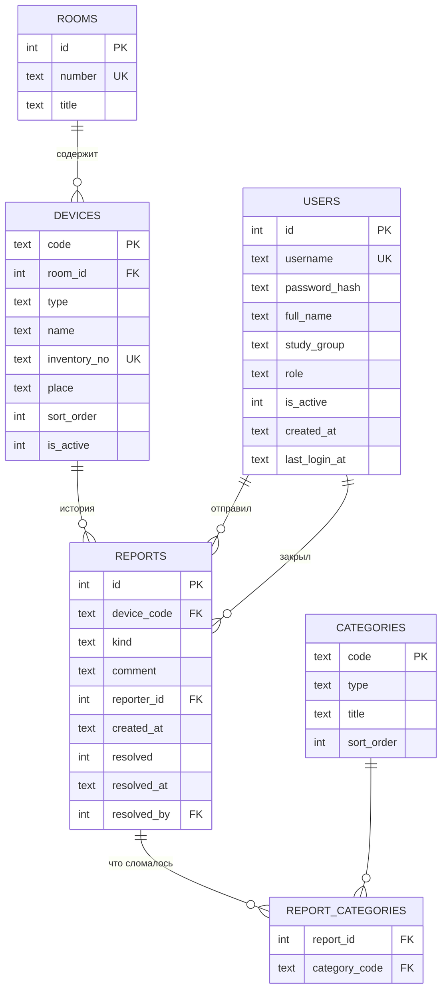

# Схема базы данных LabTrack

## 1. Общее описание

СУБД — **SQLite** (один файл, не требует отдельного сервера; для класса из 33 устройств и нескольких сотен студентов запаса производительности хватает с большим избытком). Полный DDL — [`labtrack/schema.sql`](../labtrack/schema.sql); таблицы создаются автоматически при первом запуске.

База хранит: **пользователей** (студенты и лаборанты), **устройства** класса, **отчёты** о состоянии устройств и **справочник категорий** неисправностей. Статус устройства не хранится, а вычисляется по числу открытых жалоб — так он не может разойтись с историей.

| Статус | Условие | Цвет на дашборде |
|---|---|---|
| Исправно | 0 открытых жалоб | зелёный |
| Есть жалобы | 1–2 открытые жалобы | жёлтый |
| Требует ремонта | 3 и более открытых жалоб | красный |

## 2. ER-диаграмма



Служебные таблицы: `settings` (адрес сайта для QR-кодов) и `login_attempts` (неудачные попытки входа для защиты от подбора пароля).

## 3. Таблицы

### 3.1. `users` — пользователи

| Поле | Тип | Описание |
|---|---|---|
| id | INTEGER, PK | Номер пользователя |
| username | TEXT, уникальное, без учёта регистра | Логин: латиница, цифры, `. _ -`, 3–32 символа |
| password_hash | TEXT | Хеш пароля (scrypt). Сам пароль не хранится |
| full_name | TEXT | ФИО — показывается лаборанту в истории |
| study_group | TEXT | Учебная группа студента, например `ИС-21` |
| role | TEXT: `student` \| `lab` | Роль: студент или лаборант |
| is_active | INTEGER 0/1 | 0 — учётная запись заблокирована |
| created_at, last_login_at | TEXT (ISO 8601, UTC) | Дата регистрации и последнего входа |

### 3.2. `devices` — устройства

| Поле | Тип | Описание | Пример |
|---|---|---|---|
| code | TEXT, PK | Код устройства, часть адреса в QR-коде | `pc-15` |
| room_id | INTEGER, FK → rooms | Аудитория | `1` |
| type | TEXT: `pc` \| `printer` \| `projector` | Тип | `pc` |
| name | TEXT | Название на наклейке и экранах | `ПК-15` |
| inventory_no | TEXT, уникальное | Инвентарный номер | `ИНВ-52-37-015` |
| place | TEXT | Место в классе | `Ряд 3, место 3` |
| sort_order | INTEGER | Порядок на карте класса | `15` |
| is_active | INTEGER 0/1 | 0 — списано, QR-код не принимает отметки | `1` |

### 3.3. `reports` — отчёты о состоянии (история)

| Поле | Тип | Описание |
|---|---|---|
| id | INTEGER, PK | Номер записи |
| device_code | TEXT, FK → devices | Устройство |
| kind | TEXT | `ok` — «Всё работает», `problem` — жалоба, `service` — запись лаборанта об обслуживании |
| comment | TEXT, до 300 символов | Пояснение студента или что сделал лаборант |
| reporter_id | INTEGER, FK → users | Кто отправил |
| created_at | TEXT (ISO 8601, UTC) | Когда отправлено |
| resolved | INTEGER 0/1 | Для жалобы: закрыта ли |
| resolved_at | TEXT | Когда закрыта |
| resolved_by | INTEGER, FK → users | Какой лаборант закрыл |

### 3.4. `categories` и `report_categories`

`categories` — справочник неисправностей (`type` = NULL означает «для всех типов»):

| Тип | Категории |
|---|---|
| pc | Мышь, Клавиатура, Монитор, ПО / программы, Не включается, Нет интернета |
| printer | Не печатает, Замятие бумаги, Нет бумаги, Картридж / тонер |
| projector | Нет изображения, Пульт, Кабель / HDMI, Тусклая картинка |
| все | Другое |

Одна жалоба может касаться нескольких узлов, поэтому связь «отчёт — категории» — многие-ко-многим через `report_categories` (PK: `report_id`, `category_code`).

## 4. Основные запросы

**«Требуют внимания»** — открытые жалобы по устройствам и категориям:

```sql
SELECT r.device_code, rc.category_code, COUNT(*) AS n
FROM reports r JOIN report_categories rc ON rc.report_id = r.id
WHERE r.kind = 'problem' AND r.resolved = 0
GROUP BY r.device_code, rc.category_code
ORDER BY n DESC;
-- pc-15 | mouse | 3   →  «ПК-15 — 3 жалобы: мышь ×3»
```

**История устройства** — с ФИО и группой автора:

```sql
SELECT r.created_at, r.kind, r.comment, u.full_name, u.study_group, r.resolved
FROM reports r JOIN users u ON u.id = r.reporter_id
WHERE r.device_code = 'pc-15'
ORDER BY r.created_at DESC;
```

**Закрытие жалоб лаборантом** — в одной транзакции:

```sql
BEGIN;
UPDATE reports SET resolved = 1, resolved_at = :now, resolved_by = :lab_id
 WHERE device_code = :code AND kind = 'problem' AND resolved = 0;
INSERT INTO reports (device_code, kind, comment, reporter_id, created_at, resolved, resolved_at, resolved_by)
VALUES (:code, 'service', :what_done, :lab_id, :now, 1, :now, :lab_id);
COMMIT;
```

## 5. Индексы и ограничения

- `idx_reports_device_time (device_code, created_at DESC)` — быстрая история устройства.
- `idx_reports_open` (частичный: только открытые жалобы) — подсчёт статусов для дашборда.
- `CHECK` на `role`, `type`, `kind` — в базу не попадёт недопустимое значение.
- Внешние ключи включены (`PRAGMA foreign_keys = ON`), журнал `WAL` — чтение не блокирует запись.
